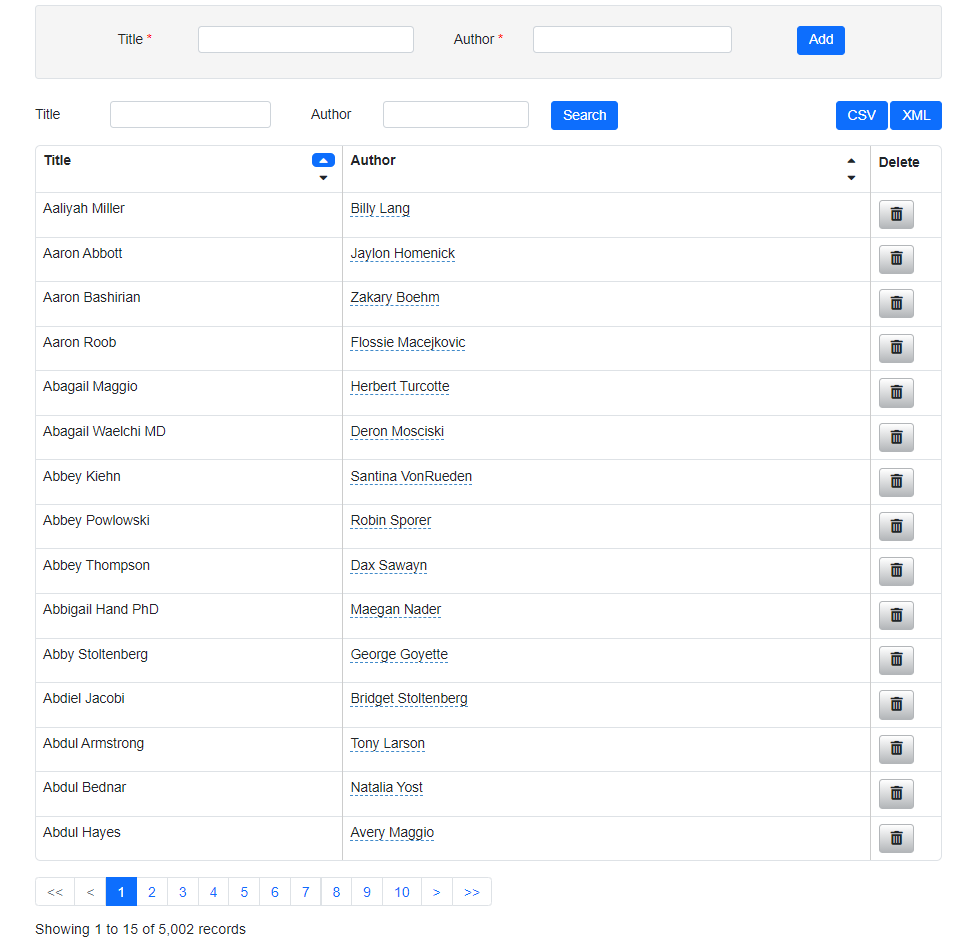
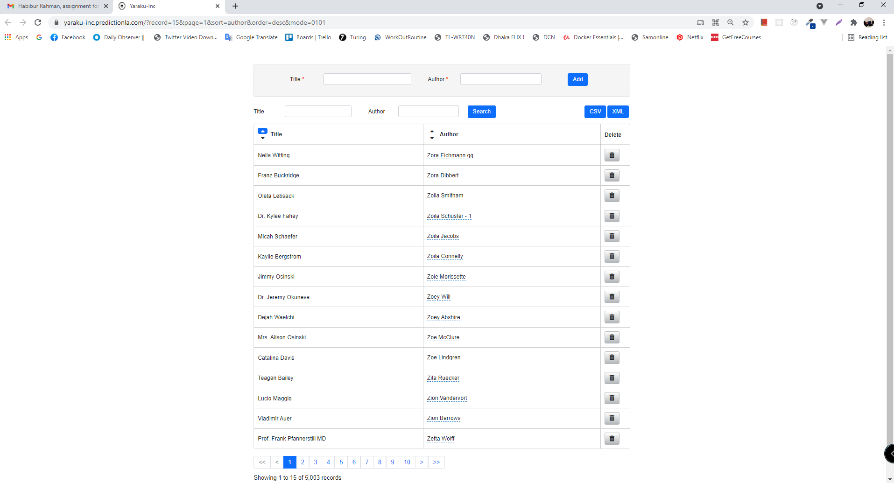

### Requirements
```
    - php 7.3
    - mysql 5.7|8.0   
```
# Installing the project in localhost
Step-1 : Clone the project 
```
    - git clone https://github.com/habib85434/yaraku-inc.git
```
Step-2 : Setup laravel (API) <br />
- Go to the src folder and rename .env.example to .env <br />
- Create database and fill the database credentials in the .env file
- Run the following commands in the terminal in the src directory
```
    - composer install
    - php artisan key:generate 
    - php artisan config:cache
    - php artisan migrate --seed
    - php artisan serve
```
Step-3 : Setup Vue (Frontend) <br />
- Go to front-end directory and run the following commands
````
    - npm install
    - npm audit fix
    - npm run serve
````
Step-4 : Run the project in the browser <br />
- If all ports are default then copy the following URL and paste it into your browser
```
    http://localhost:8080/
```



# APIs List with postman collection
- Open your postman and import the collection from ```project root``` directory
- There are 7 APIs in the ```Yaraku-inc/Books``` 
- Create an environment variable with the variable ```baseUrl``` and put the value ```http://127.0.0.1:8000/api/v1``` (if you do not change the port)
- Now it is ready to check all APIs with the postman


### Unit Test
There are unit tests are available in the ```tests/Unit/Books/``` directory
<br />
- Run all tests in single command  
```
    - php artisan test
```
or run each test or run all tests in the class by using phpStorm

### My deployment description
- I created a database called book_store
- Opened ssh and indicated it into public_html folder
- Clone the project from the git repository.
- I created two different subdomains
1. For Backend (API) and the document root directory is "project folder/src/public", <br />
2. For the Frontend which is vuejs, and the document root directory is "project folder/front-end/dist"
- Indicate ssh into src folder and change the name of .env.example to .env and put the values of database credentials  and I executed following commands

```
    - composer install
    - php artisan config:cache
```
- Indicate ssh into the front-end directory and changed the base URL in the front-end/src/main.js and I executed following commands
```
    - npm install
    - npm run build
```
Finally, it is time to check the frontend domain  with browser and it worked :  


